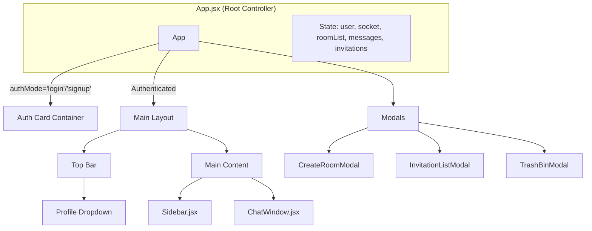
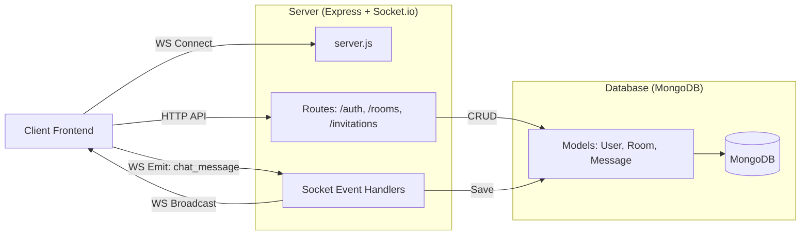

# MERN Chat Application with Socket.io

A full-stack real-time chat application built with **MongoDB, Express, React, and Node.js**. It features private and public rooms, an invitation system, and a robust trash/recovery mechanism for deleted rooms.

## Key Features

*   **Real-time Messaging:** Powered by Socket.io for instant communication.
*   **Room Management:**
    *   **Public Rooms:** Open for anyone to join.
    *   **Private Rooms:** Invite-only access.
    *   **Trash Bin:** Soft-delete rooms with a 3-day recovery window.
*   **Invitation System:** Users can invite others to private rooms; recipients can accept or reject invites.
*   **Authentication:** JWT-based secure login and signup.
*   **Responsive UI:** Clean interface with a Profile Menu, Sidebar, and Modal interactions.
*   **Docker Ready:** Fully containerized for easy deployment and local development.

---

## 🚀 Development Workflows

You can run this project in two ways depending on your needs.

### Option 1: Hybrid Mode (Recommended for Dev)
Run the Database in Docker, but run the Backend and Frontend locally on your machine. This gives you the fastest feedback loop (Hot Reload).

**Prerequisites:** Docker, Node.js installed.

1.  **Start the Database:**
    ```bash
    docker compose -f docker-compose.dev.yml up -d
    ```
2.  **Start Backend:**
    ```bash
    cd backend
    npm install
    npm run dev
    ```
3.  **Start Frontend:**
    ```bash
    cd frontend
    npm install
    npm run dev
    ```
4.  **Access:** Open `http://localhost:5173`

### Option 2: Full Docker Mode
Run the entire stack (Frontend, Backend, Database) inside containers. Best for testing the final build or "production-like" behavior.

1.  **Configure Host:**
    Open the root `.env` file and set your IP (required for LAN access, or keep `localhost`).
    ```env
    HOST_IP=localhost 
    ```
2.  **Start Everything:**
    ```bash
    docker compose up --build
    ```
3.  **Access:** Open `http://localhost:5173` (or your `HOST_IP:5173`).

---

## ⚙️ Configuration

The app is designed to be environment-agnostic. Configuration is handled via `.env` files.

*   **Root `.env`:** Controls the Docker orchestration IP (`HOST_IP`).
*   **Backend `.env`:**
    ```env
    PORT=3000
    MONGO_URI=mongodb://localhost:27017/chatapp
    FRONTEND_URL=http://localhost:5173
    JWT_SECRET=devsecret
    ```
*   **Frontend `.env`:**
    ```env
    VITE_BACKEND_URL=http://localhost:3000
    ```

---

## 🏗️ Architecture

### Frontend Component Tree



### Backend Data Flow


