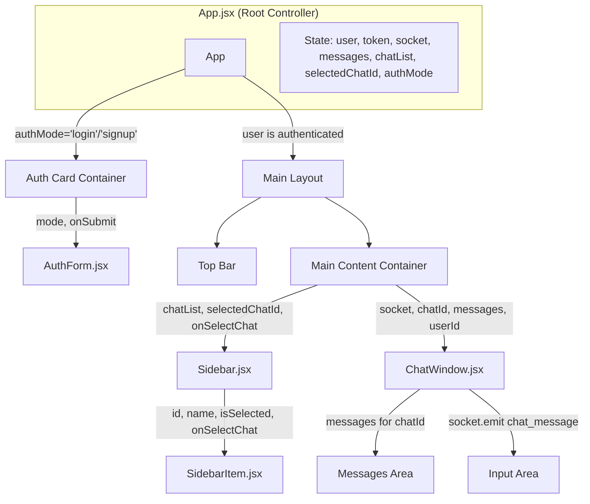
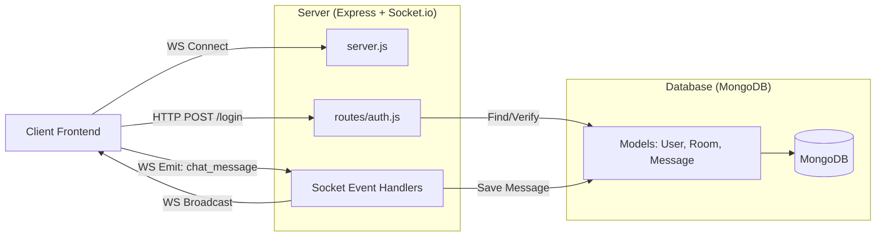

# App Overview

## Frontend Component Tree

This diagram visualizes the component hierarchy, highlighting key state management (in `App`) and the props passed down to child components.

## Component Details

### **App.jsx**
The central controller of the frontend application.
*   **Responsibilities**:
    *   **State Management**: Holds the global state for the authenticated `user`, the active `socket` connection, the list of rooms (`chatList`), and the live `messages` object.
    *   **Authentication Flow**: conditionally renders the `AuthForm` or the main chat interface based on the `user` state.
    *   **Socket.io Connection**: Establishes and manages the websocket connection, listening for `chat_message` and `room_history` events.

### **AuthForm.jsx**
A reusable form component for handling both Login and Signup actions.
*   **Props**:
    *   `mode`: Determines if the form is for "login" or "signup".
    *   `onSubmit`: Function to handle the form submission (calls the backend API).

### **Sidebar.jsx**
Renders the navigation list of available chat rooms.
*   **Props**:
    *   `chatList`: Array of room objects fetched from the backend.
    *   `selectedChatId`: ID of the currently active room to highlight it.
    *   `onSelectChat`: Handler to update the `selectedChatId` in the parent state.

### **ChatWindow.jsx**
The main interface for viewing and sending messages.
*   **Props**:
    *   `socket`: The active socket connection used to emit new messages.
    *   `chatId`: The ID of the current room (used to filter messages).
    *   `messages`: The global messages object (mapped by room ID).
    *   `userId`: Used to distinguish between "incoming" (gray) and "outgoing" (blue) messages.
*   **Key Features**:
    *   **Auto-scroll**: Uses a `useRef` to automatically scroll to the bottom when new messages arrive.
    *   **Real-time**: Listens for updates via the passed `socket` prop (managed in `App`).

## Backend Data Flow

This diagram illustrates how data flows from the client to the server and database.

